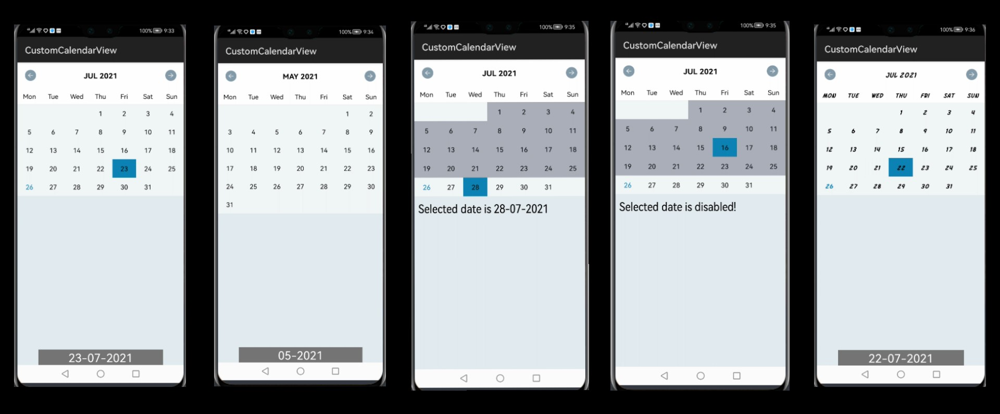
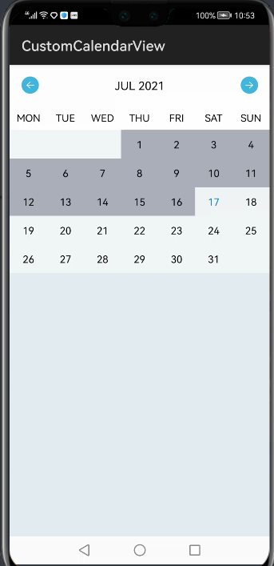

# Custom-Calendar-View
Custom-Calendar-View for Harmony Os. To use the CustomCalendarView in your application, you first need to add the library to your application. You can do this by either from Gradle, Maven or by directly downloading the source code form GitHub.


## Features
Currently it supports the following features:
* Next and previous month navigation
* Allow various customization including background color for day, week and title
* Set custom font using setCustomTypeFace() method.
* Show hide next previous month overflow days
* Set custom day options for start day of week. By default it is set to Calendar.SUNDAY
* Unlimited customizations for day of the month using custom Decorators.
* Allow you to handle event when user changes month and day selection.

## Source
The code in this repository was inspired from [npanigrahy/Custom-Calendar-View](https://github.com/npanigrahy/Custom-Calendar-View). 
We are very thankful to npanigrahy. 



## Dependency
1. For using customcalendarview module in sample app, include the source code and add the below dependencies in entry/build.gradle to generate hap/support.har.
```
dependencies {
        implementation fileTree(dir: 'libs', include: ['*.jar', '*.har'])
        testImplementation 'junit:junit:4.13'
        ohosTestImplementation 'com.huawei.ohos.testkit:runner:1.0.0.100'
        implementation project(':customcalendarview');
}
```
2. For using customcalendarview in separate application using jar file, add the jar file in the entry/libs folder and add the dependencies in entry/build.gradle file.
```
dependencies {
        implementation fileTree(dir: 'libs', include: ['*.jar'])
        testImplementation 'junit:junit:4.13'
}
```

## Using CustomCalendarView Library
The GitHub project source includes a sample application, that is used for demonstrating the various features currently supported by this library. Once the library is added to your project, you can include the CustomCalendarView into your activity/fragment layout using the following code snippets.

```
<com.stacktips.view.CustomCalendarView
	ohos:id="@+id/calendar_view"
	ohos:width="match_parent"
	ohos:height="wrap_content"
	ohos:background_element="#ffffff">
</com.stacktips.view.CustomCalendarView>
```
The above code snippet will show the simple Calendar View with default design. Now, you can use the following attributes, to customize the appearance of calendar.
```
<com.stacktips.view.CustomCalendarView
        ohos:height="match_content"
        ohos:width="match_parent"
        ohos:id="$+id:calendar_view"
        ohos:background_element="$color:off_white"
        app:calendarBackgroundColor="$color:off_white"
        app:calendarTitleTextColor="$color:black"
        app:currentDayOfMonthColor="$color:blue"
        app:dayOfMonthTextColor="$color:black"
        app:dayOfWeekTextColor="$color:black"
        app:disabledDayBackgroundColor="$color:off_white"
        app:disabledDayTextColor="$color:grey"
        app:selectedDayBackgroundColor="$color:blue"
        app:titleLayoutBackgroundColor="$color:white"
        app:weekLayoutBackgroundColor="$color:white"
        app:selectedDayTextColor="$color:black"
        app:calendarTitleBackgroundColor = "$color:white">
</com.stacktips.view.CustomCalendarView>
```
Let us now, initialize the calendar view to control the various other appearance and behavior of calendar using the following methods.
```
//Initialize CustomCalendarView from layout
calendarView = (CustomCalendarView) findComponentById(ResourceTable.Id_calendar_view);
Locale locale = Locale.getDefault();
//Initialize calendar with date
Calendar currentCalendar = Calendar.getInstance(locale);
//Show monday as first date of week
calendarView.setFirstDayOfWeek(Calendar.MONDAY);
//Show/hide overflow days of a month
calendarView.setShowOverflowDate(false);
//call refreshCalendar to update calendar the view
calendarView.refreshCalendar(currentCalendar);
//Handling custom calendar events
calendarView.setCalendarListener(new CalendarListener() {
    @Override
    public void onDateSelected(Date date) {
        SimpleDateFormat df = new SimpleDateFormat("dd-MM-yyyy");
        ToastDialog toastDialog = new ToastDialog(getContext());
        toastDialog.setText(df.format(date)).show();
    }

    @Override
    public void onMonthChanged(Date date) {
        SimpleDateFormat df = new SimpleDateFormat("MM-yyyy");
        ToastDialog toastDialog = new ToastDialog(getContext());
        toastDialog.setText(df.format(date)).show();
    }
});
```

## Using Custom Font

```
String fontFamily = "Arch_Rival_Bold.ttf";
Font typeface = getFont(fontFamily);
if (null != typeface) {
    calendarView.setCustomTypeface(typeface);
    calendarView.refreshCalendar(currentCalendar);
}
```
```
private Font getFont(String fontFamily) {
        byte[] buffer = null;
        int bytesRead = 0;
        FileOutputStream fileOutputStream = null;
        File file = new File(this.getCacheDir(), fontFamily);
        RawFileEntry rawFileEntry = this.getResourceManager().getRawFileEntry(RAW_FILE_PATH);
        try {
            Resource resource = rawFileEntry.openRawFile();
            buffer = new byte[(int) rawFileEntry.openRawFileDescriptor().getFileSize()];
            bytesRead = resource.read(buffer);
            fileOutputStream = new FileOutputStream(file);
            fileOutputStream.write(buffer, 0, bytesRead);
            fileOutputStream.close();
        } catch (IOException ioException) {
            ioException.printStackTrace();
        }
        return new Font.Builder(file).makeItalic(true).build();
}
```
Custom Calendar View Library in Harmony Os Custom Font

## Using Day Decorators
```
//adding calendar day decorators
List decorators = new ArrayList<>();
decorators.add(new ColorDecorator());
calendarView.setDecorators(decorators);
calendarView.refreshCalendar(currentCalendar);
```


## License
```
/*
 * Copyright (C) 2015 Stacktips {link: http://stacktips.com}.
 *
 * Licensed under the Apache License, Version 2.0 (the "License");
 * you may not use this file except in compliance with the License.
 * You may obtain a copy of the License at
 *
 *      http://www.apache.org/licenses/LICENSE-2.0
 *
 * Unless required by applicable law or agreed to in writing, software
 * distributed under the License is distributed on an "AS IS" BASIS,
 * WITHOUT WARRANTIES OR CONDITIONS OF ANY KIND, either express or implied.
 * See the License for the specific language governing permissions and
 * limitations under the License.
 */
```

